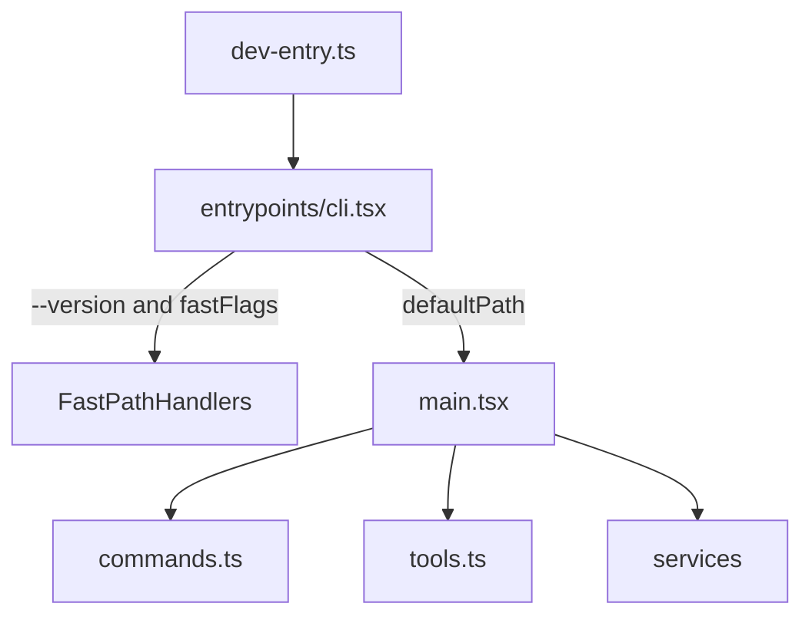

# 项目结构导读（维护者向）

本文档面向后续维护者，目标是帮助你快速建立对仓库结构、启动链路、命令与工具体系、扩展机制以及 restored 特性的整体认知。

---

## 1) 项目定位与边界

- 本仓库是基于 npm 发布包 source map 还原的 TypeScript 源码树，不是官方内部开发仓库。
- 代码已可用于本地开发和研究，但部分模块是兼容替代实现（尤其原生/私有模块相关）。
- 阅读和改动时，建议默认采用“最小、可审计变更”策略，优先保证行为可解释。

关键参考：
- `README.md`
- `AGENTS.md`

---

## 2) 快速上手

运行环境与工具链：
- Bun `>=1.3.5`
- Node.js `>=24.0.0`
- 包管理器固定为 `bun@1.3.5`

常用命令（来自 `package.json`）：
- `bun install`：安装依赖和本地 shim 包
- `bun run dev`：进入 restored CLI 开发入口
- `bun run start`：同 `dev`
- `bun run version`：验证 CLI 基础可运行性

说明：
- 根目录没有一体化 `lint`/`test` 脚本；改动后通常通过命令级 smoke test 验证。

---

## 3) 仓库总览

### 根目录

- `src/`：核心还原源码（主工作区）
- `vendor/`：原生绑定相关源码/桥接层（如音频、图像、平台能力）
- `shims/`：无法完整还原模块的本地兼容包
- `README.md`：项目背景与基础说明
- `AGENTS.md`：协作规范与开发建议
- `package.json` / `tsconfig.json` / `bun.lock`：工程配置

### `src/` 关键子目录（按维护价值）

- `entrypoints/`：CLI/MCP 入口与 bootstrap
- `commands/` + `commands.ts`：命令定义与聚合注册
- `tools/` + `tools.ts`：工具定义与工具集组装
- `services/`：服务层（API、MCP、analytics、policy、settings 等）
- `components/` + `hooks/` + `ink/`：终端 UI 层（React + Ink）
- `utils/`：跨层通用能力（配置、权限、模型、会话、git、进程等）
- `plugins/`：插件入口与内建插件装载
- `skills/`：技能加载与技能来源整合
- `state/` + `bootstrap/`：运行时状态与初始化阶段状态传递

---

## 4) 启动链路与执行路径

主路径可以理解为三段：
1. 开发入口兜底与恢复态检查：`src/dev-entry.ts`
2. CLI bootstrap 和快速路径分发：`src/entrypoints/cli.tsx`
3. 完整 CLI 运行时：`src/main.tsx`

### 4.1 `src/dev-entry.ts`（恢复工作区入口）

职责：
- 注入 `MACRO` 默认值（版本等元信息）
- 扫描 `src/` 与 `vendor/` 的相对导入可解析性
- 在缺失依赖时输出“恢复态提示”而不是直接崩溃
- 在可运行时转发到 `entrypoints/cli.tsx`

常见改动点：
- 恢复阶段的导入缺失诊断逻辑
- `--version`/`--help` 的恢复态输出文案

### 4.2 `src/entrypoints/cli.tsx`（bootstrap + fast path）

职责：
- 在最小导入成本下处理快速命令路径（例如版本输出、daemon、bridge、background sessions、模板任务等）
- 仅在需要时加载重模块，减少冷启动成本
- 对常见误用参数做重定向（如 `--update`）

常见改动点：
- 新增/调整快速路径分支
- 启动性能相关逻辑（尽量保持动态导入）

### 4.3 `src/main.tsx`（完整运行时）

职责：
- 完整初始化配置、策略、遥测、权限上下文、会话上下文
- 组装 Commander CLI 选项与子命令
- 连接命令系统、工具系统、服务层与 UI 渲染流程

注意：
- 文件体量很大（核心“总线”），建议优先从调用链切入，而不是全文通读。

---

## 5) 命令系统设计（`commands.ts` + `commands/`）

核心模型：
- `src/commands/`：各命令实现（通常以目录方式组织）
- `src/commands.ts`：统一聚合内建命令、插件命令、技能命令、工作流命令

运行时行为：
- 基础命令集合由 `COMMANDS()` 构建
- `getCommands(cwd)` 负责按当前上下文动态返回可用命令
- 命令会经过可用性与开关过滤（如账号类型、服务提供方、feature gate）
- 支持动态技能注入与去重，避免重复命令名

缓存策略：
- 命令加载使用 memoize（按 `cwd` 缓存）
- 提供清理入口（如 `clearCommandsCache`）以应对技能/插件变化

常见改动点：
- 新增命令：`src/commands/<name>/`
- 调整聚合顺序/可见性过滤：`src/commands.ts`

---

## 6) 工具系统设计（`tools.ts` + `tools/`）

核心模型：
- `src/tools/`：单个工具实现（文件、shell、网络、任务、MCP 等）
- `src/tools.ts`：工具全集定义、预设、可用性判定、权限上下文过滤

关键特征：
- 工具集合受 feature flags、环境变量、运行模式影响
- 一部分工具按需加载（避免不必要开销）
- 工具在暴露给模型前会经过权限规则筛选（deny 规则可提前剔除）

常见改动点：
- 新增工具实现：`src/tools/<ToolName>/`
- 调整默认工具暴露策略：`getAllBaseTools()` 及过滤逻辑

---

## 7) 服务层与横切能力（`src/services/`）

`src/services/` 是“可复用业务能力层”，主要包括：
- `api/`：后端接口与请求相关能力
- `mcp/`：MCP 客户端、配置、资源接入
- `analytics/`：事件与开关系统
- `policyLimits/`：策略限制加载与判定
- `remoteManagedSettings/`：远程托管设置
- `compact/`：会话压缩与上下文治理
- `plugins/` / `skillSearch/` / `tips/`：扩展生态与辅助能力

排查建议：
- 命令可见性异常：优先看 `policyLimits` + `settings` + `commands.ts` 过滤
- 工具不可用：优先看 `tools.ts` 的 `isEnabled` 与权限过滤逻辑
- MCP 资源问题：优先看 `services/mcp/` 的配置解析与连接流程

---

## 8) 扩展机制（技能、插件、工作流）

### 技能（Skills）

- 入口：`src/skills/loadSkillsDir.ts`
- 来源：本地技能目录、bundled skills、插件技能、MCP 技能（受开关影响）
- 命令层集成：在 `getCommands(cwd)` 中与其他命令源汇合

### 插件（Plugins）

- 入口：`src/utils/plugins/*` 与 `src/plugins/`
- 作用：提供额外命令/技能/行为扩展
- 缓存：命令缓存与插件缓存分层，更新后需要清理对应缓存

### 工作流（Workflows）

- 挂载点：`commands.ts` 与 `tools/WorkflowTool/*`（受 `WORKFLOW_SCRIPTS` 开关）
- 形态：可作为命令来源，也可通过工具体系提供能力

---

## 9) restored 特性：`vendor/` 与 `shims/`

### `vendor/`（原生边界）

当前可见模块包括：
- `vendor/audio-capture-src/`
- `vendor/image-processor-src/`
- `vendor/modifiers-napi-src/`
- `vendor/url-handler-src/`

作用：
- 承接平台能力/原生绑定的桥接逻辑，某些能力平台相关性强（例如 macOS 特性）。

### `shims/`（兼容替代）

当前可见 shim 包包括：
- `shims/ant-claude-for-chrome-mcp/`
- `shims/ant-computer-use-input/`
- `shims/ant-computer-use-mcp/`
- `shims/ant-computer-use-swift/`
- `shims/color-diff-napi/`
- `shims/modifiers-napi/`
- `shims/url-handler-napi/`

作用：
- 对无法完整还原的模块提供“可安装、可运行、可降级”的占位兼容层。

维护建议：
- 遇到行为与预期不一致时，先确认是否命中 shim 路径，再判定是否属于业务逻辑问题。

---

## 10) 建议阅读顺序（新维护者）

推荐按以下顺序建立认知：
1. `README.md`（背景与现状）
2. `src/dev-entry.ts`（恢复态入口）
3. `src/entrypoints/cli.tsx`（启动分发）
4. `src/main.tsx`（运行时主线）
5. `src/commands.ts`（命令聚合）
6. `src/tools.ts`（工具聚合）
7. `src/services/mcp/`、`src/services/analytics/`、`src/services/policyLimits/`（横切能力）

---

## 11) 最小验证清单（改动后）

- 能运行：`bun run version`
- 能启动：`bun run dev`
- 改命令相关代码时：至少手动触发对应命令路径
- 改工具相关代码时：验证工具是否仍能被注册、展示并通过权限过滤

---

## 12) 给未来维护者的提示

- 该仓库是“恢复工程 + 运行工程”的混合体，很多实现同时承担业务功能和恢复兼容职责。
- `main.tsx`、`commands.ts`、`tools.ts` 是全局耦合较高的关键节点，改动前先画出调用链再下手。
- 对 feature gate 与环境变量敏感的代码，建议在提交说明中记录“在哪些模式下生效”。

